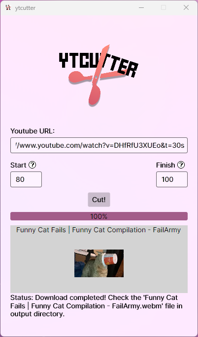

# YTCutter


A modern, cross-platform desktop application for cutting and downloading segments from YouTube videos. Built with Avalonia UI and .NET.

## Features

- 🎯 Cut specific segments from YouTube videos
- ⚡ Fast video processing using FFmpeg
- 🎨 Modern UI with Mica effect support on Windows 11
- 🌐 Cross-platform compatibility
- 🎥 High-quality video and audio download
- 📊 Progress tracking with visual feedback



## Installation

1. Head over to the [releases](https://github.com/yungtry/ytcutter/releases) page and download the latest version of YTCutter.
2. Extract the archive to a directory of your choice.
3. Open the directory and run the `ytcutter.exe` file.

## Requirements

- FFmpeg (automatically included in Windows builds, needs to be installed on other platforms)

For linux users, you can install FFmpeg using your package manager:
```sh
sudo apt-get install ffmpeg
```

For macOS users, you can install FFmpeg using Homebrew:
```sh
brew install ffmpeg
```

## Usage

1. Enter a YouTube URL in the input field
2. Specify the start time (in seconds or MM:SS format)
3. Specify the end time (in seconds or MM:SS format)
4. Click the "Cut" button
5. Wait for the download and processing to complete
6. Find your cut video in the output directory

## Build Instructions

1. Clone the repository: `git clone https://github.com/yungtry/ytcutter.git`
2. Navigate to the project directory: `cd ytcutter`
3. Run the build script: `dotnet build`
4. Run the application: `dotnet run`

## Technical Details

Built using:
- Avalonia UI for cross-platform desktop interface
- YoutubeExplode for YouTube video processing
- FFmpeg for video cutting and encoding
- .NET 6.0

## License

This project is licensed under the GNU Lesser General Public License v2.1 - see the [LICENSE](LICENSE) file for details.